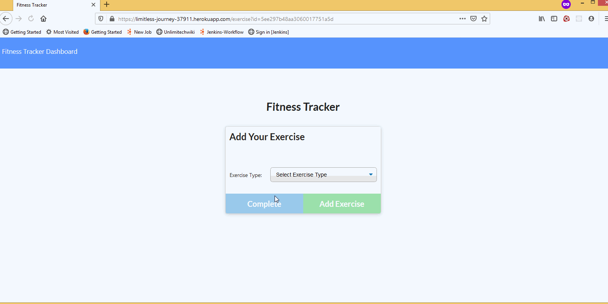

# burgers

A workout tracker Web-app made using Node js, Express, MongoDB in MVC pattern.

## Table of Contents

- [Description](#Description)
- [Installation](#Installation)
- [Usage](#Usage)
- [Credits](#Credits)
- [License](#License)
- [Contributing](#Contributing)
- [Tests](#Tests)
- [Questions](#Questions)

## Description

A webpage that lets you create workout plans and add exercises to it. You can track your weekly progress using the dashboard which shows your progress on graphs and charts.
The app is modeled in MVC pattern. Data is stored on Mongo DB so the data persists on page reload. An instance on this Web-app is deployed at -
https://limitless-journey-37911.herokuapp.com/

## Installation

To set-up the Web-app on your local machine, follow these steps -

- Set Up MongoDB server.
- Run <code>npm run seed</code>. This should create workout database and seed it with some workouts.
- Run <code>npm install</code>.
- Run <code>npm start</code>.

## Usage

- Run <code>node./server.js</code> or <code>npm start</code> .

## Credits

sandyboon(https://github.com/sandyboon)

## License

Licensed under the MIT license.

## Contributing

Contribution to this project is not permitted at this moment.

## Tests

There are no tests at this moment.

## Questions

### Email : sandy.boon@gmail.com
